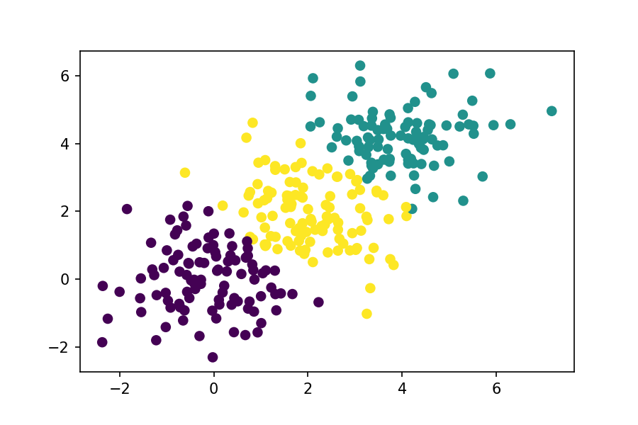
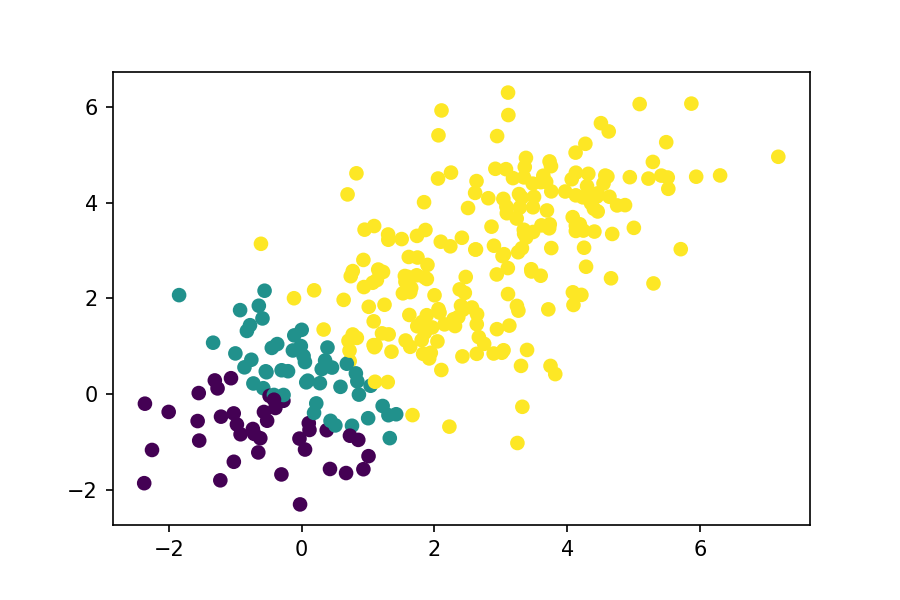

# 聚类

## 相似度与距离

对数据进行聚类时，需要计算数据间的相似度或距离以决定数据是否被分到一类中。常用的相似度或距离的计算方法有：

1. 明科夫斯基距离（其中，$p=1,2$分别为曼哈顿距离和欧氏距离）：
$$d_{ij}=\left(\sum_{k=1}^m|x_{ki}-x_{kj}|^p\right)^\frac{1}{p}$$
2. 马氏距离。设$S$是$X$的协方差矩阵，则$x_i$和$x_j$的马氏距离为：
$$d_{ij}=[(x_i-x_j)^TS^{-1}(x_i-x_j)]^\frac{1}{2}$$
3. 相关系数：
$$r_{ij}=\frac{\sum_{k=1}^m(x_{ki}-\bar x_i)(x_{kj}-\bar x_j)}{\left[\sum_{k=1}^m(x_{ki}-\bar x_i)^2\sum_{k=1}^m(x_{kj}-\bar x_j)^2\right]^\frac{1}{2}}$$
4. 余弦夹角：
$$s_{ij}=\frac{\sum_{k=1}^mx_{ki}x_{kj}}{\left[\sum_{k=1}^mx_{ki}^2\sum_{k=1}^mx_{kj}^2\right]^\frac{1}{2}}$$

## k均值聚类

常用的聚类方法主要有两种：层次聚类和k均值聚类。层次聚类的时间复杂度和空间复杂度在数据量增大时都会急速增大，因此层次聚类不太适合大规模数据集的聚类。此处主要介绍k均值聚类。k均值聚类是一种使用迭代的聚类方法。

k均值聚类使用欧氏距离平方作为样本之间的距离度量，并且定义样本与其所属类的中心的距离的总和为损失函数，即

$$W(C)=\sum_{l=1}^k\sum_{C(i)=l}||x_i-\bar x_l||^2$$

穷举所有可能情况会造成该优化问题变为一个NP困难问题。因此在此处只能使用迭代法进行求解。但是迭代法可能会使该损失函数落入一个局部极小值点。k均值聚类的迭代方法重复以下步骤直至划分结果不再改变：

1. 对于给定的中心值$(m_1,m_2,...,m_k)$，求一个划分$C$使得目标函数最小化：
$$\min_C\sum_{l=1}^k\sum_{C(i)=l}||x_i-m_l||^2$$
易于发现，该问题的求解结果为：将每个样本分到与其最近的中心$m_l$的类$G_l$中。
2. 对于给定的划分$C$，再求各个类的中心$(m_1,m_2,...,m_k)$使得目标函数最小化：
$$\min_{m_1,m_2,...,m_k}\sum_{l=1}^k\sum_{C(i)=l}||x_i-m_l||^2$$
求解结果为：$m_l=\frac{1}{n_l}\sum_{G(i)=l}x_i,l=1,2,...,k$。

因此，k均值聚类的步骤是：

**输入：**n个样本的基本$X$和类的个数k。

1. 初始化：随机初始化或者随机选取k个样本点作为初始聚类中心$m^0=(m_1^0,m_2^0,...,m_k^0)$
2. 对固定的类中心$m^t=(m_1^t,m_2^t,...,m_k^t)$，计算每个样本到类中心的距离，将每个样本点分到与其最近的中心的类中，构成聚类结果$C^t$
3. 重新计算类中心，得到新的中心值$m^{t+1}=(m_1^{t+1},m_2^{t+1},...,m_k^{t+1})$
4. 重复2,3，直到划分结果不再改变

**输出：**聚类结果$C^*$。


# 代码实现

本次使用的数据为模拟数据，数据量为300。数据可分为三组，每组各100个，中心分别为$(0,0)^T,(2,2)^T,(4,4)^T$。

```{python}
import numpy as np
np.random.seed(12345)
x1 = np.random.randn(100,2)
x2 = np.random.randn(100,2) + [2,2]
x3 = np.random.randn(100,2) + [4,4]
X = np.vstack((x1,x2,x3))
```


## sklearn实现

k均值聚类的接口位于sklearn.cluster.KMeans,其文档可见[**此处**](https://scikit-learn.org/stable/modules/generated/sklearn.cluster.KMeans.html#sklearn.cluster.KMeans)。其中较为重要的参数有：

- n_clusters：类的个数k

```{python,results='hide'}
from sklearn.cluster import KMeans

clf = KMeans(n_clusters=3)
clf.fit(X)
```
```{python,eval=FALSE}
import matplotlib.pyplot as plt
plt.scatter(X[:,0],X[:,1],c=clf.labels_)
plt.show()
```




## k均值聚类

```{python}
class kmeans:
    
    def __init__(self,k=1):
        self.k = k
        
    def fit(self,X):
        n,_ = X.shape
        ## initial
        idx = np.random.choice([i for i in range(len(X))],3)
        center = X[idx,:]
        ## iteration
        dist = np.zeros((n,self.k))
        old_center = center+1
        while np.mean(np.abs(old_center-center))>1e-4:
            ## partition
            for k in range(self.k):
                dist[:,k] = np.sum((X - center[k,:])**2,1)
            label = np.argmin(dist,1)
            ## calculate center
            old_center = center
            for k in range(self.k):
                center[k,:] = np.mean(X[label==k,:],0)
        self.center = center
        self.label = label
        
        
    def predict(self,new_X):
        n,_ = new_X.shape
        dist = np.zeros((n,self.k))
        for k in range(self.k):
            dist[:,k] = np.sum((new_X - center[k,:])**2,1)
        return np.argmin(dist,1)
```

使用该方法进行聚类时可能会达到局部极小值。一个改进的方法是使用不同的随机的初始点进行多次拟合，并从中选取效果最好的一个。其中，“效果最好的”可以根据损失函数的大小进行选择。


此处只进行了一次初值的随机选取，效果如下，可以发现其陷入了局部极小值：

```{python,eval=FALSE}
clf = kmeans(3)
clf.fit(X)
plt.scatter(X[:,0],X[:,1],c=clf.label)
```


