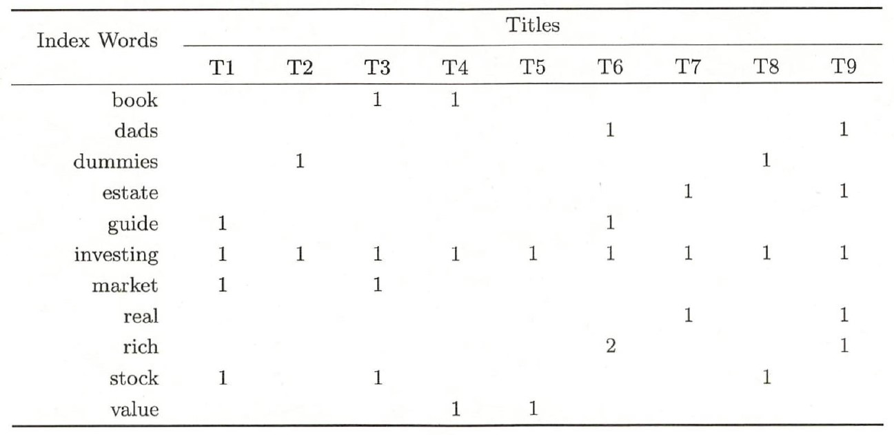

# 概率潜在语义分析

## 生成模型和共现模型

假定有单词集合$W=\{w_1,w_2,...,w_M\}$，文本集合$D=\{d_1,d_2,...,d_N\}$和话题集合$Z=\{z_1,z_2,...,z_K\}$。随机变量$w$取值于单词集合，随机变量$d$取值于文本集合，随机变量$z$随机取值于话题分布。

**生成模型**按照以下步骤生成文本-单词共现数据：

1. 依照文本的概率分布$P(d)$，从文本集合中随机选取一个文本$d$，共生成N个文本；针对每个文本，执行以下操作
2. 在文本$d$给定的条件下，依据条件概率分布$P(z|d)$，从话题集合中随机选取一个话题$z$，共生成L个话题
3. 在话题$z$给定的条件下，依据条件概率分布$P(w|z)$，对每个话题从单词集合中随机选取一个单词$w$

在此模型中，单词变量$w$和文本变量$d$是观测向量，话题变量$z$是隐变量。对于数据$T=(w,d)$，可以得到其生成概率的乘积

$$P(T)=\prod_{(w,d)}P(w,d)^{n(w,d)}$$

其中$n(w,d)$表示$(w,d)$的出现次数。对于其出现概率$P(w,d)$可以表示为：

$$P(w,d)=P(d)P(w|d)=P(d)\sum_zP(w,z|d)=P(d)\sum_zP(z|d)P(w|z)$$

其中最后一个等号是基于假设：在给定话题$z$的条件下，单词$w$与文本$d$条件独立。生成模型的数据生成步骤是$d\to z\to w$。

**共现模型**是一种和生成模型等价的模型，与生成模型$d\to z\to w$序列不同，共现模型从话题$z$出发，其同时单词$w$和文本$d$，其中生成单词的步骤需要重复多次。因此共现模型的序列为$w\gets z\to d$，$(w,d)$的出现概率为

$$P(w,d)=\sum_zP(z)P(w|z)P(d|z)$$

事实上，上式和潜在语义分析中的svd分解十分类似。潜在语义分析中将单词-文本矩阵$X$分解为$X=U\Sigma V^T$，此处可如下表示：$X=[P(w,d)]_{M\times N},U=[P(w|z)]_{M\times K},\Sigma=[P(z)]_{K\times K},V=[P(d|z)]_{N\times K}$。

## EM算法

设单词集合为$W=\{w_1,w_2,...,w_M\}$，文本集合为$D=\{d_1,d_2,...,d_N\}$，话题集合为$Z=\{z_1,z_2,...,z_K\}$。给定单词-文本共现数据$T=\{n(w_i,d_j)\},i=1,2,...,M;j=1,2,...,N$。为估计概率潜在语义分析模型的参数，构建对数似然函数：

$$
\begin{aligned}
L&=\sum_{i=1}^M\sum_{j=1}^Nn(w_i,d_j)\log P(w_i,d_j)\\
&=\sum_{i=1}^M\sum_{j=1}^Nn(w_i,d_j)\log\left[\sum_{k=1}^KP(w_i|z_k)P(z_k|d_j)\right]\\
\end{aligned}
$$

该对数似然函数中含有隐变量，因此无法直接估计，需要使用EM算法进行迭代。可以得到，概率潜在语义分析的Q函数是：

$$Q=\sum_{k=1}^K\left\{\sum_{j=1}^Nn(d_j)\left[\log P(d_j)+\sum_{i=1}^M\frac{n(w_i,d_j)}{n(d_j)}\log P(w_i|z_k)P(z_k|d_j)\right]\right\}P(z_k|w_i,d_j)$$

其中，$n(d_j)=\sum_{i=1}^Mn(w_i,d_j)$表示文本$d_j$中的单词个数，$n(w_i,d_j)$表示单词$w_i$在文本$d_j$中的出现次数。同时由于式中的$P(d_j)$可以直接从从数据中按比例估计得出，在极大化$Q$时可以不进行考虑。因此，极大化$Q$和极大化$Q^*$相同，$Q^*$形式如下：

$$Q^*=\sum_{i=1}^M\sum_{j=1}^Nn(w_i,d_j)\sum_{k=1}^KP(z_k|w_i,d_j)\log [P(w_i|z_k)P(z_k|d_j)]$$

式中的$P(z_k|w_i,d_j)$可以通过贝叶斯公式进行计算，有：

$$P(z_k|w_i,d_j)=\frac{P(w_i|z_k)P(z_k|d_j)}{\sum_{k=1}^KP(w_i|z_k)P(z_k|d_j)}$$

在$P(z_k|w_i,d_j)$可通过上一步的$P(w_i|z_k),P(z_k|d_j)$计算的情况下，可以极大化$Q^*$得到新的$P(w_i|z_k),P(z_k|d_j)$的估计。该求解过程需在约束条件$\sum_{i=1}^MP(w_i|z_k)=1,k=1,2,...,K$和$\sum_{k=1}^KP(z_k|d_j)=1,j=1,2,...,N$下进行。通过拉格朗日乘子法，可以得到：

$$P(w_i|z_k)=\frac{\sum_{j=1}^Nn(w_i,d_j)P(z_k|w_i,d_j)}{\sum_{m=1}^M\sum_{j=1}^Nn(w_m,d_j)P(z_k|w_m,d_j)}$$

$$P(z_k|d_j)=\frac{\sum_{i=1}^Mn(w_i,d_j)P(z_k|w_i,d_j)}{n(d_j)}$$

因此，概率潜在语义分析模型的步骤可如下所示：


**输入：**单词集合为$W=\{w_1,w_2,...,w_M\}$，文本集合为$D=\{d_1,d_2,...,d_N\}$，话题集合为$Z=\{z_1,z_2,...,z_K\}$，共现数据$\{n(w_i,d_j)\},i=1,2,...,M,j=1,2,...,N$。

1. 初始化参数$P(w_i|z_k),P(z_k|d_j)$。两者分别有$MK$个和$NK$个
2. 计算
$$P(z_k|w_i,d_j)=\frac{P(w_i|z_k)P(z_k|d_j)}{\sum_{k=1}^KP(w_i|z_k)P(z_k|d_j)}$$
3. 更新参数：
$$P(w_i|z_k)=\frac{\sum_{j=1}^Nn(w_i,d_j)P(z_k|w_i,d_j)}{\sum_{m=1}^M\sum_{j=1}^Nn(w_m,d_j)P(z_k|w_m,d_j)}$$
$$P(z_k|d_j)=\frac{\sum_{i=1}^Mn(w_i,d_j)P(z_k|w_i,d_j)}{n(d_j)}$$
4. 重复2,3，直至收敛

**输出：**参数$P(w_i|z_k)$和$P(z_k|d_j)$。


# 代码实现

概率潜在语义分析在sklearn中没有直接实现的函数，此处直接对其进行实现。本次考虑的数据集如下：



准备数据：

```{python}
import numpy as np

X = np.array([[0,0,1,1,0,0,0,0,0],
              [0,0,0,0,0,1,0,0,1],
              [0,1,0,0,0,0,0,1,0],
              [0,0,0,0,0,0,1,0,1],
              [1,0,0,0,0,1,0,0,0],
              [1,1,1,1,1,1,1,1,1],
              [1,0,1,0,0,0,0,0,0],
              [0,0,0,0,0,0,1,0,1],
              [0,0,0,0,0,2,0,0,1],
              [1,0,1,0,0,0,0,1,0],
              [0,0,0,1,1,0,0,0,0]])
```

概率潜在语义分析模型可按如下实现：

```{python}
class PLSA:
    
    def __init__(self,n_components=1):
        self.n_components = n_components
        
    def fit(self,X):
        M,N = X.shape
        K = self.n_components
          
        ## initialization
        wz = np.random.random((M,K))
        zd = np.random.random((K,N))
        wz = wz/np.sum(wz,0).reshape(1,-1)
        zd = zd/np.sum(zd,0).reshape(1,-1)
        
        error = 1
        while error>1e-3:
            ## calculate P(z|w,d)
            zwd = np.array([zd[:,i].reshape(-1)*wz for i in range(zd.shape[1])])
            zwd = zwd/np.sum(zwd,2).reshape(N,M,1)
            ## update P(w|z) and P(z|d)
            zwd = zwd*X.T.reshape(N,M,1)
            wz_new = np.sum(zwd,axis=0)
            wz_new = wz_new/np.sum(wz_new,0).reshape(1,-1)
            zd_new = np.sum(zwd,axis=1).T
            zd_new = zd_new/np.sum(zd_new,0).reshape(1,-1)
        
            error = np.mean(np.abs(zd_new-zd))+np.mean(np.abs(wz_new-wz))
            wz,zd = wz_new,zd_new
            
        self.wz = wz
        self.zd = zd
```

其结果如下：

```{python}
clf = PLSA(n_components=3)
clf.fit(X)
print('单词-话题分布：\n',np.around(clf.wz,3))
print('话题-文本分布：\n',np.around(clf.zd,3))
```

