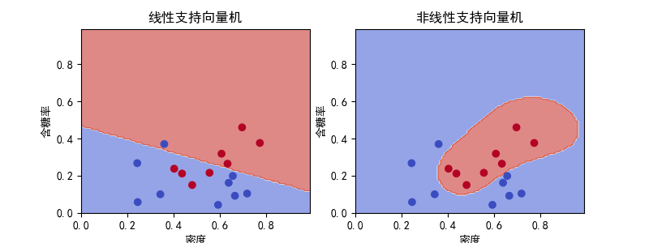

# 原始问题和对偶问题

## 原始问题

支持向量机中需要使用原始问题和对偶问题的转换来简化问题的求解。

假设$f(x),c_i(x),h_j(x)$是定义在$R^n$上的连续可微函数。将如下带约束的最优化问题称为原始问题：

$$
\begin{aligned}
\min_{x\in R^n}&\quad f(x) \\
s.t. &\quad c_i(x)\le0,i=1,2,...,k \\
&\quad h_j(x)=0,j=1,2,...,l
\end{aligned}
$$

对其引入广义拉格朗日函数：

$$L(x,\alpha,\beta)=f(x)+\sum_{i=1}^k\alpha_ic_i(x)+\sum_{j=1}^l\beta_jh_j(x)$$
其中，$\alpha_i,\beta_j$是拉格朗日乘子，$\alpha_i\ge0$。考虑以下函数：

$$
\begin{aligned}
\theta_P(x)&=\max_{\alpha,\beta:\alpha_i\ge0}L(x,\alpha,\beta)\\
&=\max_{\alpha,\beta:\alpha_i\ge0}[f(x)+\sum_{i=1}^k\alpha_ic_i(x)+\sum_{j=1}^l\beta_jh_j(x)]
\end{aligned}
$$
当$x$满足约束条件$c_i(x)\le0$和$h_j(x)=0$时，有：

$$
\begin{aligned}
L(x,\alpha,\beta)&=f(x)+\sum_{i=1}^k\alpha_ic_i(x)+\sum_{j=1}^l\beta_jh_j(x)\\
&\le f(x)+\sum_{i=1}^k\alpha_i\cdot0+\sum_{j=1}^l\beta_j\cdot0\\
&=f(x)
\end{aligned}
$$

而当$x$不满足约束条件时，则当$c_i(x)>0$时，令$\alpha_i\to+\infty$，当$h_j(x)\ne0$时，令$\beta_j\to\infty\cdot I(h_j(x)<0)$，其余的$\alpha_i,\beta_j$均取为0。此时有：

$$\max_{\alpha,\beta:\alpha_i\ge0}[f(x)+\sum_{i=1}^k\alpha_ic_i(x)+\sum_{j=1}^l\beta_jh_j(x)]=+\infty$$

因此，
$$\theta_P(x)=\max_{\alpha,\beta:\alpha_i\ge0}L(x,\alpha,\beta)=f(x)$$

且取到最大值时，$x$必位于约束条件区域内。所以**求解原始问题的最小值等价于求解拉格朗日函数的极小极大问题**：

$$\min_{x}\max_{\alpha,\beta:\alpha_i\ge0}L(x,\alpha,\beta)$$

此外不妨假设原始问题的最优解$p^*=\min_x\theta_P(x)$。

## 对偶问题
原始问题求解的是$\min_{x}\max_{\alpha,\beta:\alpha_i\ge0}L(x,\alpha,\beta)$，而对偶问题求解的则是$\max_{\alpha,\beta:\alpha_i\ge0}\min_{x}L(x,\alpha,\beta)$，可以将其表示为如下约束最优化问题：

$$
\begin{aligned}
\max_{\alpha,\beta}&\theta_D(\alpha,\beta):=\max_{\alpha,\beta:\alpha_i\ge0}\min_{x}L(x,\alpha,\beta) \\
s.t. &\quad \alpha_i\ge0,i=1,2,...,k
\end{aligned}
$$

不妨假设对偶问题的最优解$d^*=\max_{\alpha,\beta:\alpha_i\ge0}\theta_D(\alpha,\beta)$。

## 原始问题和对偶问题

我们可以简单地证明：若原始问题和对偶问题都有最优值，则$d^*\le p^*$。

**Proof：**

$$\min_xL(x,\alpha,\beta)\le L(x,\alpha,\beta)\le \max_{\alpha,\beta:\alpha_i\ge0}L(x,\alpha,\beta)$$

上式对任意满足条件的$x,\alpha,\beta$均成立，因此有：

$$\max_{\alpha,\beta:\alpha_i\ge0}\min_{x}L(x,\alpha,\beta)\le L(x,\alpha,\beta)\le \min_{x}\max_{\alpha,\beta:\alpha_i\ge0}L(x,\alpha,\beta)$$
因此$d^*\le p^*$。

以上结果说明：原始问题和对偶问题是相关的，但不一定等价。

首先，若$x^*$和$\alpha^*,\beta^*$分别是原始问题和对偶问题的可行解且$d^*=p^*$，则$x^*$和$\alpha^*,\beta^*$分别是原问题和对偶问题的最优解。因此，当$d^*=p^*$时，我们便可以使用解对偶问题来解原始问题。

其次，**对于支持向量机问题，其原始问题和对偶问题是等价的。**

再者，在满足一些条件的情况下（如在支持向量机中），原始问题和对偶问题的解$x^*$和$\alpha^*,\beta^*$和其满足KKT条件互为充分必要条件。KKT条件为：

1. $\nabla_xL(x^*,\alpha^*,\beta^*)=0$
2. $\alpha_i^*c_i(x^*)=0,i=1,2,...,k$
3. $c_i(x^*)\le0,i=1,2,...,k$
4. $\alpha_i^*\ge0,i=1,2,...,k$
5. $h_j(x^*)=0,j=1,2,...,l$


# 线性支持向量机

## 硬间隔

给定数据集$T=\{(x_1,y_1),(x_2,y_2),...,(x_N,y_N)\},x_i\in R^n,y_i\in\{-1,1\},i=1,2,...,N$。此处数据集$T$线性可分。

由于$T$线性可分，所以存在无穷个超平面可将数据正确分开。硬间隔支持向量机(线性可分支持向量机)将使用**间隔最大化**作为准则，从这些超平面中选出最优的分离超平面。

**定义：**对于给定的数据集$T$和超平面$(\omega,b)$。超平面$(\omega,b)$关于样本点$(x_i,y_i)$的几何间隔为：

$$\gamma_i=y_i(\frac{\omega}{||\omega||}\cdot x_i+\frac{b}{||\omega||})$$

易于发现在分类正确的情况下，$\gamma_i$即为点$(x_i,y_i)$至超平面$(\omega,b)$的距离，且$\gamma_i$的取值与$\omega,b$的数量级无关。记$\gamma=\min_{i=1,2,...,N}\gamma_i$。

硬间隔支持向量机最大化几何间隔，因此其可表示为以下优化问题：

$$
\begin{aligned}
\max_{\omega,b}\quad &\gamma \\
s.t.\quad &y_i(\frac{\omega}{||\omega||}\cdot x_i+\frac{b}{||\omega||})\ge\gamma,i=1,2,...,N
\end{aligned}
$$

令$\hat\gamma=||\omega||\gamma$，该优化问题便等价于：

$$
\begin{aligned}
\max_{\omega,b}\quad &\frac{\hat\gamma}{||\omega||} \\
s.t.\quad &y_i(\omega\cdot x_i+b)\ge\hat\gamma,i=1,2,...,N
\end{aligned}
$$

此外，由于$\omega,b$的同比例放缩不影响该问题的求解，不妨设$\hat\gamma=1$。此外由于最大化$\frac{1}{||\omega||}$和最小化$\frac{1}{2}||\omega||^2$等价。因此该问题又等价于：

$$
\begin{aligned}
\min_{\omega,b}\quad &\frac{1}{2}||\omega||^2 \\
s.t.\quad &y_i(\omega\cdot x_i+b)-1\ge0,i=1,2,...,N
\end{aligned}
$$

这是一个凸二次规划问题。因此求解线性可分支持向量机便等价于求解以上优化问题的最优解$\omega^*,b^*$。

## 对偶问题

对于支持向量机的优化问题，其对偶问题比原始问题更容易求解。引入拉格朗日乘子$\alpha_i\ge0,i=1,2,...,N$，该优化问题的拉格朗日函数为：

$$L(\omega,b,\alpha)=\frac{1}{2}||\omega||^2+\sum_{i=1}^N\alpha_i(1-y_i(\omega\cdot x_i+b))$$

对偶问题优化如下表达式：$\max_{\alpha}\min_{\omega,b}L(\omega,b,\alpha)$，首先求$\min_{\omega,b}L(\omega,b,\alpha)$。

$$
\begin{aligned}
\frac{\partial L(\omega,b,\alpha)}{\partial \omega}&=\omega-\sum_{i=1}^N\alpha_iy_ix_i \\
\frac{\partial L(\omega,b,\alpha)}{\partial b}&=-\sum_{i=1}^N\alpha_iy_i
\end{aligned}
$$

令两式等于0，可得$\omega=\sum_{i=1}^N\alpha_iy_ix_i,\sum_{i=1}^N\alpha_iy_i=0$。将其代回拉格朗日函数有：

$$
\begin{aligned}
\min_{\omega,b}L(\omega,b,\alpha)&=\min_{\omega,b}\frac{1}{2}||\omega||^2+\sum_{i=1}^N\alpha_i(1-y_i(\omega\cdot x_i+b))\\
&=\frac{1}{2}\sum_{i=1}^N\sum_{j=1}^N\alpha_i\alpha_jy_iy_j(x_i\cdot x_j)+\sum_{i=1}^N\alpha_i-\sum_{i=1}^N\alpha_iy_i((\sum_{j=1}^N\alpha_jy_jx_j)\cdot x_i+b)\\
&=-\frac{1}{2}\sum_{i=1}^N\sum_{j=1}^N\alpha_i\alpha_jy_iy_j(x_i\cdot x_j)+\sum_{i=1}^N\alpha_i
\end{aligned}
$$

因此对偶问题等价于对$\alpha$最大化$\min_{\omega,b}L(\omega,b,\alpha)$，这等价于以下最优化问题：

$$
\begin{aligned}
\min_\alpha\quad& \frac{1}{2}\sum_{i=1}^N\sum_{j=1}^N\alpha_i\alpha_jy_iy_j(x_i\cdot x_j)-\sum_{i=1}^N\alpha_i\\
s.t.\quad&\sum_{i=1}^N\alpha_iy_i=0\\
&\alpha_i\ge0,\quad i=1,2,...,N
\end{aligned}
$$

该对偶问题和原始问题**相互等价**。因此可以先求出对偶问题的最优解$\alpha^*$，再将$\alpha^*$转化为原始问题的最优解$\omega^*,b^*$。

由KKT条件，可知$\nabla_\omega L(\omega^*,b^*,\alpha^*)=\omega^*-\sum_{i=1}^N\alpha_i^*y_ix_i=0$，因此有$\omega^*=\sum_{i=1}^N\alpha_i^*y_ix_i$。

此外可以注意到，至少有一个$\alpha_j^*>0$(否则有$\omega^*=0$，其不为原始问题的解)。由KKT条件知，对$j$有：$y_j(\omega^*\cdot x_j+b^*)-1=0$，因此：

$$b^*=\frac{1}{y_j}-\omega^*\cdot x_j=y_j-\sum_{i=1}^N\alpha_i^*y_i(x_i\cdot x_j)$$

因此硬间隔支持向量机算法可如下：

**输入：**线性可分的数据集$T=\{(x_1,y_1),(x_2,y_2),...,(x_N,y_N)\}$，其中$x_i\in R^n,y_i\in\{-1,1\},i=1,2,...,N$。

1. 求解约束最优化问题：
$$
\begin{aligned}
\min_\alpha\quad& \frac{1}{2}\sum_{i=1}^N\sum_{j=1}^N\alpha_i\alpha_jy_iy_j(x_i\cdot x_j)-\sum_{i=1}^N\alpha_i\\
s.t.\quad&\sum_{i=1}^N\alpha_iy_i=0\\
&\alpha_i\ge0,\quad i=1,2,...,N
\end{aligned}
$$
2. 得到问题的最优解$\alpha^*=(\alpha_1^*,\alpha_2^*,...,\alpha_N^*)^T$，计算：
$$\omega^*=\sum_{i=1}^N\alpha_i^*y_ix_i$$
同时选择$\alpha^*$的一个正分量$\alpha_j^*>0$，计算：
$$b^*=y_j-\sum_{i=1}^N\alpha_i^*y_i(x_i\cdot x_j)$$
3. 得到分离超平面$\omega^*\cdot x+b^*=0$和分类决策函数$f(x)=sign(\omega^*\cdot x+b^*)$

**输出：**分离超平面和分类决策函数。


## 软间隔

硬间隔支持向量机要求数据集线性可分。不过通常情况下，数据集存在一些特异点，导致数据集不是线性可分的。但在去掉了这些点后，数据集仍是线性可分的。

线性不可分意味着数据集中的某些样本点$(x_i,y_i)$不能满足条件$y_i(\omega\cdot x_i+b)-1\ge0$。我们可以加入一个松弛变量$\xi_i\ge0$，降低约束条件的要求，使约束条件变为：

$$y_i(\omega\cdot x_i+b)\ge1-\xi_i$$

不过为了防止约束条件变得过于松弛，我们需要在目标函数上添加关于$\xi_i$的正则项。引入惩罚超参数$C$，目标函数可以调整为$\frac{1}{2}||\omega||^2+C\sum_{i=1}^N\xi_i$。因此，软间隔支持向量机可以转化以下优化问题：

$$
\begin{aligned}
\min_{\omega,b}\quad &\frac{1}{2}||\omega||^2+C\sum_{i=1}^N\xi_i \\
s.t.\quad &y_i(\omega\cdot x_i+b)\ge1-\xi_i,\quad i=1,2,...,N \\
& \xi_i\ge0,\quad i=1,2,...,N
\end{aligned}
$$
可以证明该优化问题中：$\omega$的解是唯一的，但$b$的解可能不唯一。

同样地，我们尝试将软间隔支持向量机也转换为对偶问题。引入乘子$\alpha_i\ge0,\mu_i\ge0$，该问题的拉格朗日函数是：

$$L(\omega,b,\xi,\alpha,\mu)=\frac{1}{2}||\omega||^2+C\sum_{i=1}^N\xi_i+\sum_{i=1}^N\alpha_i(1-\xi_i-y_i(\omega\cdot x_i+b))-\sum_{i=1}^N\mu_i\xi_i$$

因此，对偶问题便是求解以下极大极小问题：

$$\max_{\alpha,\mu}\min_{\omega,b,\xi}L(\omega,b,\xi,\alpha,\mu)$$
首先求解：$\min_{\omega,b,\xi}L(\omega,b,\xi,\alpha,\mu)$。对变量分别求偏导有：

$$
\begin{aligned}
\frac{\partial L(\omega,b,\xi,\alpha,\mu)}{\partial \omega}&=\omega-\sum_{i=1}^N\alpha_iy_ix_i=0 \\
\frac{\partial L(\omega,b,\xi,\alpha,\mu)}{\partial b}&=-\sum_{i=1}^N\alpha_iy_i=0 \\
\frac{\partial L(\omega,b,\xi,\alpha,\mu)}{\partial \xi_i}&=C-\alpha_i-\mu_i=0
\end{aligned}
$$

可以求得：

$$\omega = \sum_{i=1}^N\alpha_iy_ix_i$$
$$\sum_{i=1}^N\alpha_iy_i=0$$
$$C-\alpha_i-\mu_i=0$$

将其代回拉格朗日函数，有：

$$
\begin{aligned}
\min_{\omega,b,\xi}L(\omega,b,\xi,\alpha,\mu)&=\min_{\omega,b,\xi}[\frac{1}{2}||\omega||^2+C\sum_{i=1}^N\xi_i+\sum_{i=1}^N\alpha_i(1-\xi_i-y_i(\omega\cdot x_i+b))-\sum_{i=1}^N\mu_i\xi_i]\\
&=-\frac{1}{2}\sum_{i=1}^N\sum_{j=1}^N\alpha_i\alpha_jy_iy_j(x_i\cdot x_j)+\sum_{i=1}^N(C-\alpha_i-\mu_i)\xi_i-\sum_{i=1}^N\alpha_iy_ib+\sum_{i=1}^N\alpha_i \\
&=-\frac{1}{2}\sum_{i=1}^N\sum_{j=1}^N\alpha_i\alpha_jy_iy_j(x_i\cdot x_j)+\sum_{i=1}^N\alpha_i
\end{aligned}
$$
因此，对偶问题可转化为如下问题：

$$
\begin{aligned}
\max_{\alpha,\mu}&\quad -\frac{1}{2}\sum_{i=1}^N\sum_{j=1}^N\alpha_i\alpha_jy_iy_j(x_i\cdot x_j)+\sum_{i=1}^N\alpha_i \\
s.t. &\quad \sum_{i=1}^N\alpha_iy_i=0 \\
&\quad C-\alpha_i-\mu_i=0\\
&\quad \alpha_i\ge0\\
&\quad \mu_i\ge0\\
\end{aligned}
$$
注意到后三个约束条件等价于$0\le\alpha_i\le C$。所以，该对偶问题可以简化为如下形式：

$$
\begin{aligned}
\min_{\alpha}&\quad \frac{1}{2}\sum_{i=1}^N\sum_{j=1}^N\alpha_i\alpha_jy_iy_j(x_i\cdot x_j)-\sum_{i=1}^N\alpha_i \\
s.t. &\quad \sum_{i=1}^N\alpha_iy_i=0 \\
&\quad 0\le\alpha_i\le C,\quad i=1,2,...,N\\
\end{aligned}
$$

同理，我们可以通过KKT条件，在求得$\alpha$的最优解$\alpha^*$后，可如下求得$\omega^*,b^*$：

$$
\begin{aligned}
\omega^*&=\sum_{i=1}^N\alpha_i^*y_ix_i \\
b^*&=y_j-\sum_{i=1}^Ny_i\alpha_i^*(x_i\cdot x_j)
\end{aligned}
$$
其中，下标$j$对应的$\alpha_j^*$有：$0\le\alpha_j^*\le C$。注意到，由于满足条件的$\alpha_j^*$可能有许多个，所以$b^*$不唯一。

软间隔支持向量机算法可总结如下：

**输入：**数据集$T=\{(x_1,y_1),(x_2,y_2),...,(x_N,y_N)\}$，其中$x_i\in R^n,y_i\in\{-1,1\},i=1,2,...,N$和惩罚超参数$C$。

1. 求解约束最优化问题：
$$
\begin{aligned}
\min_{\alpha}&\quad \frac{1}{2}\sum_{i=1}^N\sum_{j=1}^N\alpha_i\alpha_jy_iy_j(x_i\cdot x_j)-\sum_{i=1}^N\alpha_i \\
s.t. &\quad \sum_{i=1}^N\alpha_iy_i=0 \\
&\quad 0\le\alpha_i\le C,\quad i=1,2,...,N\\
\end{aligned}
$$
2. 得到问题的最优解$\alpha^*=(\alpha_1^*,\alpha_2^*,...,\alpha_N^*)^T$，计算：
$$\omega^*=\sum_{i=1}^N\alpha_i^*y_ix_i$$
同时选择$\alpha^*$的一个分量满足$0\le\alpha_j^*\le C$，计算：
$$b^*=y_j-\sum_{i=1}^N\alpha_i^*y_i(x_i\cdot x_j)$$
3. 得到分离超平面$\omega^*\cdot x+b^*=0$和分类决策函数$f(x)=sign(\omega^*\cdot x+b^*)$

**输出：**分离超平面和分类决策函数。

## 合页损失

软间隔支持向量机的原始问题为：
$$
\begin{aligned}
\min_{\omega,b}\quad &\frac{1}{2}||\omega||^2+C\sum_{i=1}^N\xi_i \\
s.t.\quad &y_i(\omega\cdot x_i+b)\ge1-\xi_i,\quad i=1,2,...,N \\
& \xi_i\ge0,\quad i=1,2,...,N
\end{aligned}
$$

令
$$
\xi_i=[1-y_i(\omega\cdot x_i+b)]_+=
\begin{cases}
1-y_i(\omega\cdot x_i+b) &,1-y_i(\omega\cdot x_i+b)>0 \\
0 &,1-y_i(\omega\cdot x_i+b)\le0
\end{cases}
$$

所以$\xi_i\ge0$。且当$1-y_i(\omega\cdot x_i+b)>0$时，有$y_i(\omega\cdot x_i+b)=1-\xi_i$；当$1-y_i(\omega\cdot x_i+b)\le0$时，有$y_i(\omega\cdot x_i+b)\ge1=1-\xi_i$。综上即有$y_i(\omega\cdot x_i+b)\ge1-\xi_i$。因此$\omega,b,\xi_i$满足原始问题的约束条件，若取$\lambda=\frac{1}{2C}$，目标函数可转化为
$$\min_{\omega,b}\sum_{i=1}^N[1-y_i(\omega\cdot x_i+b)]_++\lambda||\omega||^2$$

该目标函数中的第一项称为**合页损失函数**。因此支持向量机的优化问题也可转为合页损失函数的优化问题。不过合页损失函数不是连续可导的，优化较为困难，从而使用也不太广泛。

# 非线性支持向量机

## 核技巧

对于非线性的分类问题，可以使用核技巧，即使用非线性支持向量机对数据进行分类。对于非线性问题，往往采用的方法是使用一个非线性变换，将非线性问题转换为线性问题，并通过求解变换后的线性问题来求解原始的非线性问题。核技巧的基本想法就是通过一个非线性变换将输入空间映射到特征空间，并在特征空间中求解线性支持向量机问题。

**定义：**设$X$是输入空间，$H$是特征空间，如果存在一个从$X$到$H$的映射$\phi(x):X\to H$，使得对于任意$x,z\in X$，函数$K(x,z)$满足：

$$K(x,z)=\phi(x)\cdot \phi(z)$$
则称$K(x,z)$是核函数，$\phi(x)$是映射函数。

核技巧巧妙的地方在于：我们**可以在只知道核函数$K(x,z)$而不知道映射函数$\phi(x)$的情况下求解问题**。

因此，核技巧的使用便等价于核函数的选取。一般来说，构造核函数时一般使用正定核或Mercer核。常用的核函数有：

- 线性核函数：$K(x,z)=x\cdot z$
- 多项式核函数：$K(x,z)=(x\cdot z+1)^p$
- 高斯核函数：$K(x,z)=\exp(-\frac{||x-z||^2}{2\sigma^2})$

## 非线性支持向量机

线性支持向量机的对偶问题为：
$$
\begin{aligned}
\min_{\alpha}&\quad \frac{1}{2}\sum_{i=1}^N\sum_{j=1}^N\alpha_i\alpha_jy_iy_j(x_i\cdot x_j)-\sum_{i=1}^N\alpha_i \\
s.t. &\quad \sum_{i=1}^N\alpha_iy_i=0 \\
&\quad 0\le\alpha_i\le C,\quad i=1,2,...,N\\
\end{aligned}
$$

但使用核技巧时，其目标函数便可转换为：

$$
\begin{aligned}
\theta(\alpha)&=\frac{1}{2}\sum_{i=1}^N\sum_{j=1}^N\alpha_i\alpha_jy_iy_j(\phi(x_i)\cdot \phi(x_j))-\sum_{i=1}^N\alpha_i \\
&= \frac{1}{2}\sum_{i=1}^N\sum_{j=1}^N\alpha_i\alpha_jy_iy_jK(x_i,x_j)-\sum_{i=1}^N\alpha_i
\end{aligned}
$$
可以看到目标函数只与核函数$K(.,.)$有关，映射函数$\phi(.)$在计算中被消去了。同样，对于预测函数中的映射函数也可用核函数进行代替：

$$
\begin{aligned}
f(x)&=sign(\omega^*\cdot \phi(x)+b^*)\\
&=sign((\sum_{i=1}^N\alpha_i^*y_i\phi(x_i))\cdot \phi(x)+b^*)\\
&=sign(\sum_{i=1}^N\alpha_i^*y_iK(x_i,x)+b^*)
\end{aligned}
$$

因此，非线性支持向量机便可在只给出核函数的情况下进行求解。其算法步骤如下：

**输入：**数据集$T=\{(x_1,y_1),(x_2,y_2),...,(x_N,y_N)\}$，其中$x_i\in R^n,y_i\in\{-1,1\},i=1,2,...,N$，核函数$K(x,z)$和惩罚超参数$C$。

1. 求解约束最优化问题：
$$
\begin{aligned}
\min_{\alpha}&\quad \frac{1}{2}\sum_{i=1}^N\sum_{j=1}^N\alpha_i\alpha_jy_iy_jK(x_i,x_j)-\sum_{i=1}^N\alpha_i \\
s.t. &\quad \sum_{i=1}^N\alpha_iy_i=0 \\
&\quad 0\le\alpha_i\le C,\quad i=1,2,...,N\\
\end{aligned}
$$
2. 得到问题的最优解$\alpha^*=(\alpha_1^*,\alpha_2^*,...,\alpha_N^*)^T$，选择$\alpha^*$的一个分量满足$0\le\alpha_j^*\le C$，计算：
$$b^*=y_j-\sum_{i=1}^N\alpha_i^*y_iK(x_i,x_j)$$
3. 得到分类决策函数$f(x)=sign(\sum_{i=1}^N\alpha_i^*y_iK(x_i,x)+b^*)$

**输出：**分类决策函数。

# 优化算法：SMO算法

目前支持向量机中还有一个问题需要解决，即如何求解支持向量机的优化问题。SMO算法是一种高效解决支持向量机学习问题的优化方法。SMO算法可以求解如下凸二次规划的对偶问题：

$$
\begin{aligned}
\min_{\alpha}&\quad \frac{1}{2}\sum_{i=1}^N\sum_{j=1}^N\alpha_i\alpha_jy_iy_jK(x_i,x_j)-\sum_{i=1}^N\alpha_i \\
s.t. &\quad \sum_{i=1}^N\alpha_iy_i=0 \\
&\quad 0\le\alpha_i\le C,\quad i=1,2,...,N\\
\end{aligned}
$$

SMO算法从KKT条件入手。由于KKT条件是该优化问题的充要条件，因此SMO算法每次选出2个变量进行子问题的优化，其中一个变量是违反KKT条件最严重的一个。如此，SMO算法的步骤便可分解为如下两个步骤：

1. 从所有变量中选出两个变量
2. 对这两个变量构造一个子二次规划问题，并对其进行优化(该问题存在解析解)

SMO算法不断重复以上两个步骤，直至收敛。

## 子二次规划求解

不妨设选择的两个变量是$\alpha_1,\alpha_2$，其余变量$\alpha_3,\alpha_4,...,\alpha_N$在此次规划问题被视作固定的。因此，在子问题中，略去常数项，SMO算法的目标函数可以表示为：

$$
\begin{aligned}
\min_{\alpha_1,\alpha_2}\quad &W(\alpha_1,\alpha_2)=\frac{1}{2}K_{11}\alpha_1^2+\frac{1}{2}K_{22}\alpha_2^2+y_1y_2K_{12}\alpha_1\alpha_2- \\
&\quad\quad\quad\quad\quad\quad(\alpha_1+\alpha_2)+y_1\alpha_1\sum_{i=3}^Ny_i\alpha_iK_{i1}+y_2\alpha_2\sum_{i=3}^Ny_i\alpha_iK_{i2}\\
s.t.\quad &\alpha_1y_1+\alpha_2y_2=-\sum_{i=3}^N\alpha_iy_i:=\zeta\\
& 0\le\alpha_i\le C,\quad i=1,2
\end{aligned}
$$

其中，$K_{ij}=K(x_i,x_j),i,j=1,2,...,N,\zeta$是常数。记：

$$g(x)=\sum_{i=1}^N\alpha_iy_iK(x_i,x)+b$$
$$E_i:=g(x_i)-y_i=\sum_{j=1}^N\alpha_jy_jK(x_j,x_i)+b-y_i,\quad i=1,2$$

$$v_i:=\sum_{j=3}^N\alpha_jy_jK(x_i,x_j)=g(x_i)-\sum_{j=1}^2\alpha_jy_jK(x_i,x_j)-b,\quad i=1,2$$

因此目标函数可以写成：

$$
\begin{aligned}
W(\alpha_1,\alpha_2)=&\frac{1}{2}K_{11}\alpha_1^2+\frac{1}{2}K_{22}\alpha_2^2+y_1y_2K_{12}\alpha_1\alpha_2-\\
&(\alpha_1+\alpha_2)+y_1v_1\alpha_1+y_2v_2\alpha_2
\end{aligned}
$$
由于$\alpha_1=\frac{1}{y_1}(\zeta-\alpha_2y_2)=y_1(\zeta-\alpha_2y_2)$。将其代入目标函数$W(\alpha_1,\alpha_2)$中，其可变为一个单变量问题：

$$
\begin{aligned}
W(\alpha_2)=&\frac{1}{2}K_{11}(\zeta-\alpha_2y_2)^2+\frac{1}{2}K_{22}\alpha_2^2+y_2K_{12}(\zeta-\alpha_2y_2)\alpha_2-\\
&(\zeta-\alpha_2y_2)y_1-\alpha_2+v1(\zeta-\alpha_2y_2)+y_2v_2\alpha_2\\
\end{aligned}
$$

对$\alpha_2$求导，有：

$$
\begin{aligned}
\frac{\partial W(\alpha_2)}{\partial\alpha_2}=&K_{11}\alpha_2-K_{11}\zeta y_2+K_{22}\alpha_2-2K_{12}\alpha_2+K_{12}\zeta y_2+\\
&y_1y_2-1-v_1y_2+y_2v_2
\end{aligned}
$$

令其等于0，可以得到：

$$
\begin{aligned}
(K_{11}+K_{22}-2K_{12})\alpha_2&=y_2(y_2-y_1+\zeta K_{11}-\zeta K_{12}+v_1-v_2)\\
&=y_2[y_2-y_1+\zeta K_{11}-\zeta K_{12}+(g(x_1)-\sum_{j=1}^2y_j\alpha_jK_{1j}-b)-\\
&\quad(g(x_2)-\sum_{j=1}^2y_j\alpha_jK_{2j}-b)]
\end{aligned}
$$

等号右侧将$\zeta=\alpha_1y_1+\alpha_2y_2$代入，经过整理。等号右侧表达式等价于$(K_{11}+K_{22}-2K_{12})\alpha_2+y_2(E_1-E_2)$。因此，若令$\eta=K_{11}+K_{22}-2K_{12}$，参数更新表达式为：

$$\alpha_2^{new}:=\alpha_2^{old}+\frac{y_2(E_1-E_2)}{\eta}$$

不过由于该优化问题有$0\le\alpha_1,\alpha_2\le C$的约束条件，因此参数的更新还需要经过剪辑。易知，参数$\alpha_2^{new}$有下界$L$和上界$H$，满足$L\le\alpha_2^{new}\le H$，其中：

$$
L=
\begin{cases}
\max(0,\alpha_2^{old}-\alpha_1^{old})&,y_1\ne y_2\\
\max(0,\alpha_2^{old}+\alpha_1^{old}-C)&,y_1=y_2\\
\end{cases},
H=
\begin{cases}
\min(C,C+\alpha_2^{old}-\alpha_1^{old})&,y_1\ne y_2\\
\min(C,\alpha_2^{old}+\alpha_1^{old})&,y_1=y_2\\
\end{cases}
$$
因此，$\alpha_2$的更新表达式需改变为：

$$
\alpha_2^{new}=
\begin{cases}
H&,\alpha_2^{old}+\frac{y_2(E_1-E_2)}{\eta}>H\\
\alpha_2^{old}+\frac{y_2(E_1-E_2)}{\eta}&,L\le\alpha_2^{old}+\frac{y_2(E_1-E_2)}{\eta}\le H\\
L&,\alpha_2^{old}+\frac{y_2(E_1-E_2)}{\eta}<L
\end{cases}
$$
此时，$\alpha_1$的更新公式为：

$$\alpha_1^{new}=\alpha_1^{old}+y_1y_2(\alpha_2^{old}-\alpha_2^{new})$$

## 变量选择方法

SMO算法在子问题中只选择两个变量进行优化，其中一个是违反KKT条件的。

### 违反KKT条件的变量选取

训练样本应满足KKT条件，即：

$$
\begin{aligned}
\alpha_i=0&\iff y_ig(x_i)\ge1\\
0<\alpha_i<C&\iff y_ig(x_i)=1\\
\alpha_i=C&\iff y_ig(x_i)\le1\\
\end{aligned}
$$

检验时先从所有$0<\alpha_i<C$的点上开始寻找，随后再找其他点，偏差最大的点可成为第一个选取的变量。

### 第二个变量的选择

一个简单的做法是选择使$|E_1-E_2|$最大的变量，即如果$E_1>0$，则选择最小的$E_i$作为$E_2$，否则选择最大的。不过若此方法选出的两个变量对目标函数的下降趋势帮助不大，则可尝试先重新选择第二个变量，再重新选择第一个变量的启发式方法。

### 更新$b$和$E_i$

由于在计算$\alpha$时需要使用到$b$和$E_i$，因此需不断对其进行更新。

当$0<\alpha_1^{new}<C$时，由KKT条件知：

$$\sum_{i=1}^N\alpha_iy_iK_{i1}+b=y_1$$

所以，

$$b_1^{new}=y_1-\sum_{i=3}^N\alpha_iy_iK_{i1}-\alpha_1^{new}y_1K_{11}-\alpha_2^{new}y_2K_{21}$$

此外，由于

$$E_1=\sum_{i=3}^N\alpha_iy_iK_{i1}+\alpha_1^{old}y_1K_{11}+\alpha_2^{old}y_2K_{21}+b^{old}-y_1$$

代入，有

$$b_1^{new}=b^{old}-E_1-y_1K_{11}(\alpha_1^{new}-\alpha_1^{old})-y_2K_{21}(\alpha_2^{new}-\alpha_2^{old})$$
同理，如果$0<\alpha_2^{new}<C$，则

$$b_2^{new}=b^{old}-E_2-y_1K_{12}(\alpha_1^{new}-\alpha_1^{old})-y_2K_{22}(\alpha_2^{new}-\alpha_2^{old})$$

如果$\alpha_1^{new},\alpha_2^{new}$同时满足$0<\alpha_i^{new}<C,i=1,2$，则$b_1^{new}=b_2^{new}$。如果$\alpha_1^{new},\alpha_2^{new}$中有0或$C$，则设置$b^{new}=\frac{b_1^{new}+b_2^{new}}{2}$。

$E_i$的更新方法如下：

$$E_i^{new}=\sum_{\{j:\alpha_j\le C\}}y_j\alpha_jK(x_i,x_j)+b^{new}-y_i$$

综上，SMO算法如下：

**输入：**数据集$T=\{(x_1,y_1),(x_2,y_2),...,(x_N,y_N)\}$，其中$x_i\in R^n,y_i\in\{-1,1\},i=1,2,...,N$和精度$\epsilon$。

1. 取初值$\alpha^{(0)}=0,b=0$，令$k=0$
2. 选取优化变量$\alpha_1^{(k)},\alpha_2^{(k)}$
3. 计算变量$E_1,E_2,\eta$
4. 更新变量$\alpha_1^{(k)},\alpha_2^{(k)}$至$\alpha_1^{(k+1)},\alpha_2^{(k+1)}$
5. 更新变量$E_1,E_2,b$
5. 若在精度$\epsilon$内满足停止条件：
$$
y_i\cdot g(x_i)
\begin{cases}
\ge1&, \{x_i|\alpha_i=0\} \\
=1&, \{x_i|0<\alpha_i<C\} \\
\le1&, \{x_i|\alpha_i=C\} \\
\end{cases}
$$
则令$\alpha=\alpha^{(k+1)}$并输出，否则令$k=k+1$并回到2

**输出：**$\alpha^*$。

# 代码实现

考虑的数据集为*西瓜3.0数据表*，具体可见txt文档。

## sklearn实现

准备数据：

```{python}
import pandas as pd
data = pd.read_table('melon.txt',sep=' ')
data['好瓜'] = data['好瓜'].apply(lambda x:2*x-1)
X = data[['密度','含糖率']].values
Y = data['好瓜'].values
```


支持向量机的sklearn接口位于sklearn.svm.SVC,其文档可见[**此处**](https://scikit-learn.org/stable/modules/generated/sklearn.svm.SVC.html)。其中较为重要的参数有：

- C：惩罚项
- kernel：核函数，选项包括：linear，poly，rbf等

```{python, eval=FALSE}
from sklearn.svm import SVC
clf_linear = SVC(C=5,kernel='linear')
clf_linear.fit(X,Y)
clf_rbf = SVC(C=5,kernel='rbf')
clf_rbf.fit(X,Y)
```

画出对应的分割平面，可以看出非线性支持向量机在此问题中比线性支持向量机更适合。

```{python,eval=FALSE}
import matplotlib.pyplot as plt
plt.rcParams['font.sans-serif']=['SimHei']
plt.rcParams['axes.unicode_minus']=False

plt.figure(figsize=(8,4),dpi=100)
title = ['线性支持向量机','非线性支持向量机']
for i,clf in enumerate([clf_linear,clf_rbf]):
    plt.subplot(1,2,i+1)
    xx, yy = np.meshgrid(np.arange(0,1,0.01),np.arange(0,1,0.01))
    Z = clf.predict(np.c_[xx.ravel(), yy.ravel()])
    Z = Z.reshape(xx.shape)
    plt.contourf(xx, yy, Z, cmap=plt.cm.coolwarm, alpha=0.6)
    plt.scatter(X[:,0], X[:,1], c=Y, cmap=plt.cm.coolwarm)
    plt.xlabel('密度')
    plt.ylabel('含糖率')
    plt.title(title[i])
```


## SMO算法和核支持向量机

我们使用SMO算法来实现支持向量机，此处只实现其一个简化版的SMO算法。该简化算法总体上与原始的SMO算法类似，仅仅是在选取变量时有微小的改动，对第二个变量使用随机筛选法，具体可见[**此处**](http://cs229.stanford.edu/materials/smo.pdf)。

```{python,eval=FALSE}
class SVM:
    
    def __init__(self,kernel='linear',d=3,sigma=1,
                      C=1,tol=1e-2,max_pass=50):
        self.C = C
        self.tol = tol
        self.max_passes = max_pass
        
        if kernel=='linear':
            def kernel(x1,x2):
                return np.sum(x1*x2)
        elif kernel=='poly':
            def kernel(x1,x2):
                return np.sum((x1*x2+1)**d)
        elif kernel=='rbf':
            def kernel(x1,x2):
                return np.exp(-np.sum((x1-x2)**2)/(2*sigma**2))
            
        self.kernel = kernel
        
    def fit(self,X,Y):
        N = X.shape[0]
        self.N = N
        self.alpha = np.zeros(N)
        self.b = 0
        passes = 0
        self.X = X
        self.Y = Y
        
        self.K = np.zeros((N,N))
        for i in range(N):
            for j in range(N):
                self.K[i,j] = self.kernel(X[i,:],X[j,:])
        
        while passes<self.max_passes:
            num_changed_alphas = 0
            for i in range(N):
                E_i = np.sum(self.alpha*Y*self.K[i,:])+self.b-Y[i]
                if (Y[i]*E_i<-self.tol and self.alpha[i]<self.C) or\
                   (Y[i]*E_i>self.tol and self.alpha[i]>0):
                    j = np.random.choice([j for j in range(N) if j!=i])
                    E_j = np.sum(self.alpha*Y*self.K[j,:])+self.b-Y[j]
                    alpha_i_old,alpha_j_old = self.alpha[i],self.alpha[j]
                    if Y[i] != Y[j]:
                        L = max(0,self.alpha[j]-self.alpha[i])
                        H = min(self.C,self.C+self.alpha[j]-self.alpha[i])
                    else:
                        L = max(0,self.alpha[i]+self.alpha[j]-self.C)
                        H = min(self.C,self.alpha[i]+self.alpha[j])
                    
                    if L==H:
                        continue
                    eta = 2*self.K[i,j]-self.K[i,i]-self.K[j,j]
                    if eta>=0:
                        continue
        
                    alpha_j = self.alpha[j]-Y[j]*(E_i-E_j)/eta
                    alpha_j = H if alpha_j>H else alpha_j
                    alpha_j = L if alpha_j<L else alpha_j
                    
                    if np.abs(alpha_j-self.alpha[j])<1e-5:
                        continue
                    
                    alpha_i = self.alpha[i]+Y[i]*Y[j]*(alpha_j_old-alpha_j)
                    
                    b1 = self.b-E_i-Y[i]*(alpha_i-alpha_i_old)*self.K[i,i]\
                                   -Y[j]*(alpha_j-alpha_j_old)*self.K[i,j]
                    b2 = self.b-E_j-Y[i]*(alpha_i-alpha_i_old)*self.K[i,j]\
                                   -Y[j]*(alpha_j-alpha_j_old)*self.K[j,j]
                    
                    if 0<alpha_i and alpha_i<self.C:
                        b = b1
                    elif 0<alpha_j and alpha_j<self.C:
                        b = b2
                    else:
                        b = (b1+b2)/2
                    
                    self.alpha[i],self.alpha[j]=alpha_i,alpha_j
                    self.b = b
                    num_changed_alphas += 1
            
            if num_changed_alphas==0:
                passes += 1
            else:
                passes = 0
                
    def predict_sample(self,new_X):
        return np.sign(np.sum([self.alpha[i]*self.Y[i]*self.kernel(self.X[i,:],new_X)\
            for i in range(self.N)])+self.b)
    
    def predict(self,new_X):
        return [self.predict_sample(new_X[i,:]) for i in range(new_X.shape[0])]
```

其结果如下：

```{python,eval=FALSE}
import matplotlib.pyplot as plt
plt.rcParams['font.sans-serif']=['SimHei']
plt.rcParams['axes.unicode_minus']=False

clf_linear = SVM(C=5)
clf_linear.fit(X,Y)
clf_rbf = SVM(kernel='rbf',C=5,sigma=0.2)
clf_rbf.fit(X,Y)

plt.figure(figsize=(8,3),dpi=100)
title = ['线性支持向量机','非线性支持向量机']
for i,clf in enumerate([clf_linear,clf_rbf]):
    plt.subplot(1,2,i+1)
    xx, yy = np.meshgrid(np.arange(0,1,0.01),np.arange(0,1,0.01))
    Z = clf.predict(np.c_[xx.ravel(), yy.ravel()])
    Z = np.array(Z).reshape(xx.shape)
    plt.contourf(xx, yy, Z, cmap=plt.cm.coolwarm, alpha=0.6)
    plt.scatter(X[:, 0], X[:, 1], c=Y, cmap=plt.cm.coolwarm)
    plt.xlabel('密度')
    plt.ylabel('含糖率')
    plt.title(title[i])
```


